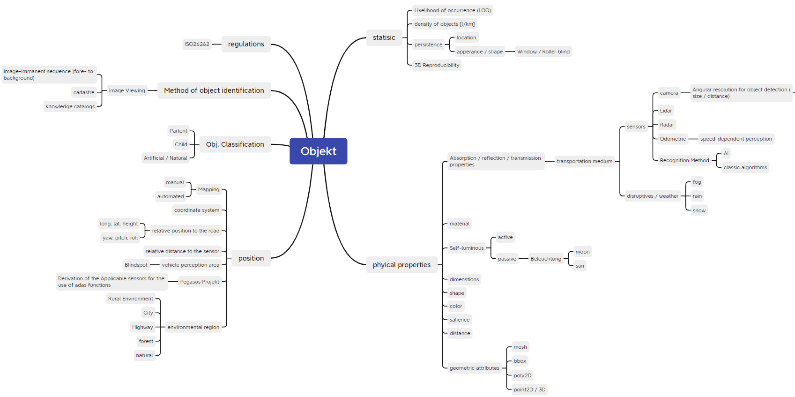

<!-- # UNDER CONSTRUCTION -->
# Landmarks for Object-Based Visual Outdoor Localization Approaches of Automated Ground Vehicles

This page contains several information for the object based localization methods by using landmarks:

* A mindmap for the overview of all proposed attributes for object description, georeferencing for the creation of future datasets.

* A table with objects, attributes and suitability in comparsion of their suitability for object-based localization methods. The suitability is claculated by the object-based norm
* * [Download full object catalog in excel format](/ObjectCatalog.xlsx)

**Mindmap with object attributes**

    

  
 
**Assumptions for calculating the object localization suitability**

*Important:* All referenced sources of object attributes can be found in the Microsoft Excel table.
- A frontfacing camera is mounted in a car and driving along a straight road.
- While driving towards the object, a distance towards the object d = [-300 to 0] was assumed.
- The camera to the right side of the Road = 1,75m 
- Germany has a street length in = 627000 km
- Camera Z height (above the street) = 1.2 m
- Area of Germany = 357386 km²

  

**object localization suitability calculatoin**

The object localization suitability calculated by normed object projection on image plane, its porbability of occurence and persistence.
1.  The real world object is projected via pinhole model to a camera image plane.
    The object area normalization on image plane is done via the integration of the object's projected area along the longitudinal distance $d_{x} \in [d_{min},d_{max}]$ to a frustum and its division through the distance:

$$ a_{img,norm} = \frac{1}{d_{max}-d_{min}} \cdot \int_{d_{min}}^{d_{max}} a_{img}(x_{veh}) * dx $$

2. The attribute probability of occurrence (PO) in objects per kilometre beside the roads.
3. The persistence of objects correlate with the update cycle of map.
   
Finally the object localization suitability is calculated:

$$ suitability = a_{img,norm} \cdot PO \cdot PS $$

  

**Table with Object Attributes and Localization Suitability**

|Nummer   |Class   |Object  |Distance|Distance|Dimension 2D|a_obj   |Spatial plane|Frustum volume|a_norm  |Dimension|Shape   |Normed obj|Material|Surface |Probalitly of Occurence|Persistence|Environment|AI Dataset|Distribution around Vehicle|Suitability|
| --------|--------|--------|--------|--------|--------    |--------|--------     |--------      |--------|-------- |--------|--------  |--------|--------|--------               |--------   |--------   |--------  |-------  				     |--------   |
|         |        |        |min     |max     |            |        |             |              |        |handling |        |          |        |        |                       |           |           |          |                           |           |               
|         |        |        |[m]     |[m]     |[cm x cm]   |[m²]    |             |[m³]          |[m²]    |[2D/3D]  |        |          |        |        |[1/km]  				  |[yr]		  |           |          |           				 |           | 
|1|buildings|buildings|1,5|300|h=1000 x w=1000|100|YZ|66,33333333|0,222222222|3D / 2D|Building|no|wood, concrete, metal, glass, plastic|regular / irregular|30,7814992|60|city, rural, highway|-|360°|68,40333156|
|2|vegitation|tree|3|300|h=50 - 3000|69|YZ|22,77|0,076666667|3D||no|wood|irregular, -, matt|22,02316647|200|city, rural, highway, forest, natural|~|360°|16,88442762|
|3|ground objects|lane|10|300|l=30000 x w=300||XY|53,94|0,1798|2D|Rect|yes|asphalt, concrete, Schoter|Regelmäsig, rough|3,333333333|30|-|x|Fahrtrichtung|5,993333333|
|4|landscapes|edge of forest|5|300|w=20000 x 18000|360|YZ|70,8|0,24|3D||no|soil, stone|irregular,-, matt|1,958537827|100|city, rural, highway, forest, natural|-|360°|4,700490786|
|5|infrastructure|electricity pylon|20|300|h=2000 - 5100 x b=800|200|YZ|9,333333333|0,033333333|3D||no|wood, concrete, metal|regular, smooth, matt|2,461161551|80|rural, highway|-|360°|0,820387184|
|6|traffic sign|lane markings|10|300|w=12 - 30 x l=600-1200||XY|5,394|0,01798|2D||yes|plastic, glass|regular, rough, reflective|3,333333333|5|city, rural, highway |x|360°|0,299666667|
|7|traffic sign|sign|3|300|d=42 - 120|0,64|YZ|0,2112|0,000711111|2D||yes|metal sheet|regular, smooth, reflective|37,4800638|16|city, rural, highway, forest, natural|x|360°|0,266524898|
|8|buildings|church spires|15|300|h=40 x w=8m|320|YZ|20,26666667|0,071111111|2D/3D||no|wood, concrete, metal|regular, smooth, matt|0,357201812|100|city, rural, highway |-|360°|0,254010178||
|9|traffic restraint systems |traffic barrier|1,5|300|b=310 - 370,Upper edge=75|| XZ |54,24864375|0,180828813|2D/3D||yes|metal|regular, smooth, matt|0,102073365|50|city, rural, highway|~|360°|0,184578054|
|10|street lights|street lights|5|300|d_pole=8 |0,96|YZ|0,1888|0,00064|3D|point / sphere / planar|no|metal, glass|regular, smooth, matt|15,15151515|40|city|~|360°|0,096969697|
|11|animal buildings|anthill|5|300|h=20 - 200|0,6|YZ|0,118|0,0004|3D||no|soil, wood|irregular,-, matt|14,83239697|15|forest, natural|-|360°|0,059329588|
|12|traffic restraint systems|noise barrier|5|300|h=3,5 x l=300||XY|125,965|0,419883333|2D||no|wood, concrete, metal|regular, smooth, matt|0,003827751|80|city, highway|-|Fahrtrichtung|0,016072089|
|13|city furniture|trashcan|2|300|w=30 x h=60|0,18|YZ|0,0894|0,0003|3D||no|wood, concrete, metal|regular / irregular, smooth, matt|5,187082956|12|city|x|360°|0,015561249|
|14|city furniture|advertising pillar|5|300|d=140 x h=310|4,34|YZ|0,853533333|0,002893333|2D/3D||no|wood, concrete, metal|regular, smooth, matt|0,468640795|100|city|~|360°|0,01355934||
|15|traffic sign|delinator|1,5|300|w=12 x h=100|0,12|YZ|0,0796|0,000266667|3D|trihedron|yes|plastic, reflector|regular, smooth, reflective - matt|9,728867624|5|rural, highway|x|360°|0,012971823|
|16|water bodies|river|5|300|l=30000 x w=500||XY|450000|1500|2D||no|water|irregular,-, matt|0,000629571|100|city, rural, highway, forest, natural|-|360°|9,443570817|
|17|light signal systems|traffic lights|1,5|300|d=10 - 30|0,3|YZ|0,199|0,000666667|2D/3D|round|yes|plastic, glass|regular, smooth, matt|0,079744817|10|city, rural, highway|x|360°|0,000531632|
|18|obstacles|big plant pot|1,5|300|h=60 x w=100|0,6|YZ|0,398|0,001333333|3D|pot, rectangular|no|wood, concrete, metal|regular, smooth, matt|-|-|city, rural, highway, forest, natural|-|360°|0|
|19|miscellaneous|bale storage|5|300|d=150||YZ|||2D/3D||no|-|-|-|-|-|-|360°||
|20|orientation object|Mercedes star|2|300|d=100-300||YZ|||3D||no|wood, concrete, metal|irregular, -, -|-|-|city, rural, highway, forest, natural|-|360°||
|21|water bodies| waterway |3|300|w=2000||XY|||2D/3D||no|water|irregular, -, reflective-matt|0,011923445|100|city, rural, highway, forest, natural|-|360°||

